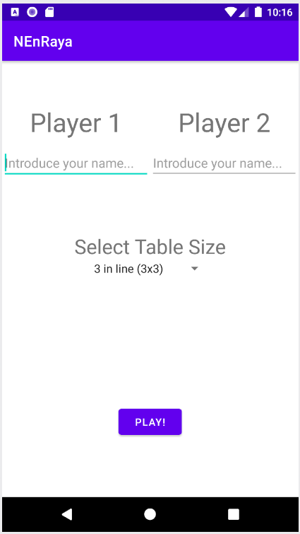
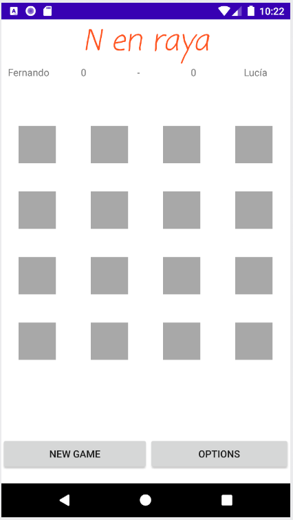

# N en Raya (N in line)

This Android App is about the classic game of 3 in line. However, in this case, the user can choose between 3 in line, with a 3x3 table; 4 in line, with a 4x4 table; or 5 in line, with a 5x5 table.

## Code Structure

The code structure is composed by Two activities (MainActivity and GameActivity) and one fragment (OptionsFragment):

### MainActivity:

Its purpose is to show the initial screen. It contains a simple login where each player must introduce his name.
Also, users can choose the table size. Then, you can start the game by pressing the *Play* button!

### GameActivity:

When the game starts, the *GameActivity* is shown. This activity contains a title, a marker, the game table and two buttons (one for start a new game and the other to see the settings).

### OptionsFragment:
